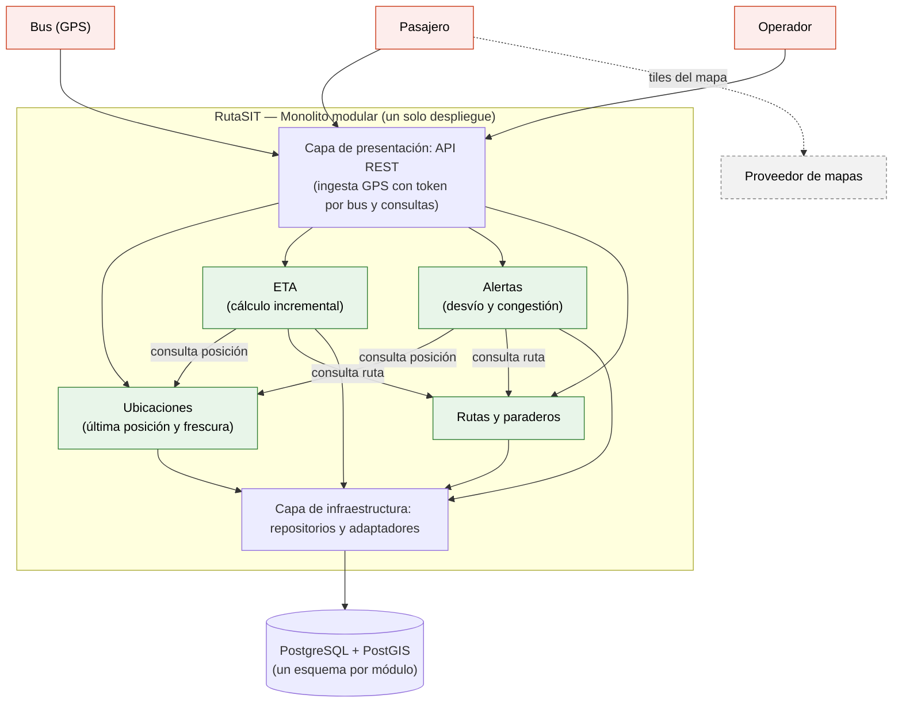
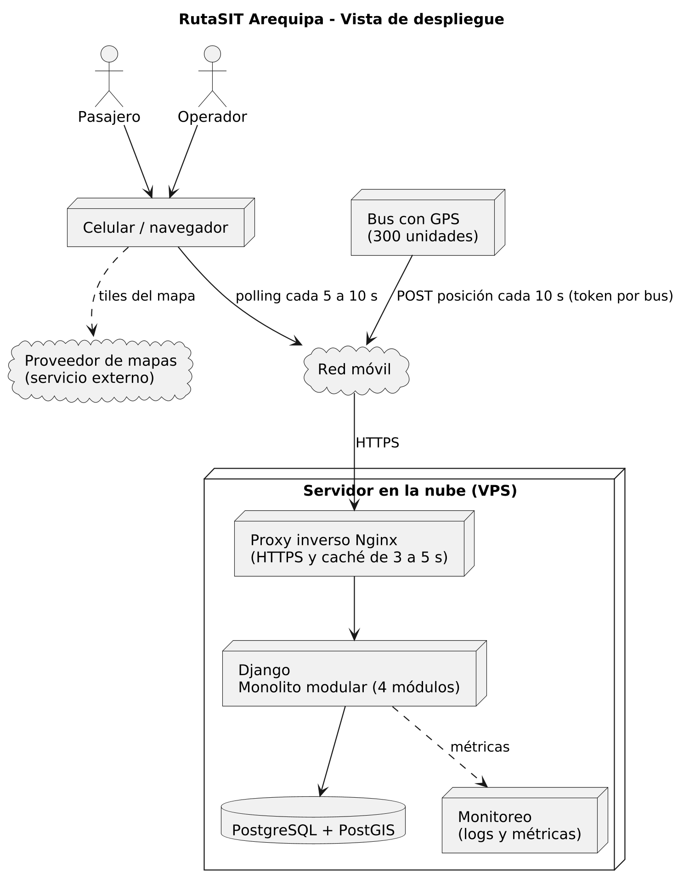

# RutaSIT Arequipa — Laboratorio 04: Fundamentos de arquitectura de software
Construcción de Software · EPIS-UNSA · 2026-B · Grupo 06
## Integrantes
| Nombre | Rol en el laboratorio |
|--------|------------------------|
| Camila | Trabajo individual: drivers, matriz de decisión, ADR, diagramas, bitácora y verificación de la IA |

## Caso
RutaSIT Arequipa permite seguir en tiempo real los buses del Sistema Integrado de Transporte. 300 buses envían su posición GPS cada 10 s; los pasajeros ven los buses en un mapa y consultan el tiempo estimado de llegada (ETA) a un paradero, y el operador recibe alertas de desvío o congestión. El atributo de calidad crítico es el rendimiento en tiempo real: el ETA debe actualizarse en ≤ 15 s (p95) desde la recepción del GPS. El MVP debe salir en 1 mes con un solo developer y un servidor de bajo costo.

## Arquitectura elegida
Monolito modular con ETA incremental, un solo despliegue y PostgreSQL.

## Documentos
- [Drivers y escenarios de calidad](docs/architecture/drivers.md)
- [Matriz de decisión](docs/architecture/matriz-decision.md)
- [Bitácora de uso de IA](docs/architecture/bitacora-ia.md)
- Diagrama de la alternativa descartada (PlantUML): `docs/architecture/diagramas/alternativa.puml`
- Vista de despliegue: `docs/architecture/diagramas/despliegue.puml`

## Vista de despliegue
Por falta de tiempo para instalar Graphviz, la vista de despliegue (E6) se elaboró con un diagrama de despliegue de **PlantUML** en lugar de Python Diagrams.

## Decisiones arquitectónicas
- [ADR-001: Estilo arquitectónico](docs/architecture/adr/001-estilo-arquitectonico.md)
- [ADR-002: Polling vs WebSocket](docs/architecture/adr/002-polling-vs-websocket.md)
- [ADR-003: Estado actual en PostgreSQL](docs/architecture/adr/003-estado-actual-postgresql.md)

## Reflexión sobre el uso de la IA
La IA es una herramienta muy útil al momento de hacer diversas actividades, siendo una de esas el crear alternativas y escoger las mejores, lo que pasa es que no podemos depender completamente de estas ya que estas suelen contener errores al momento de crear. Un ejemplo de esta ayuda fue en la creacion de este laboratorio donde se uso Claude y ChatGPT los cuales ayudaron a generar tres alternativas de estilo, a criticarlas y a redactar el código de los diagramas. Claude afirmó que su alternativa era la única que atacaba el atributo crítico y planteó una mitigación incoherente (reconstruir el estado desde PostgreSQL sin haber persistido antes los datos) cosa que era un error en lo que se buscaba; ambas lo reconocieron al criticarse a sí mismas. ChatGPT recomendó WebSocket sin considerar que la carga depende de los pasajeros conectados y no de los 300 buses. Al final siempre se necesita que una persona verifique lo que te manda para tener una mejor coherencia y un buen trabajo.
